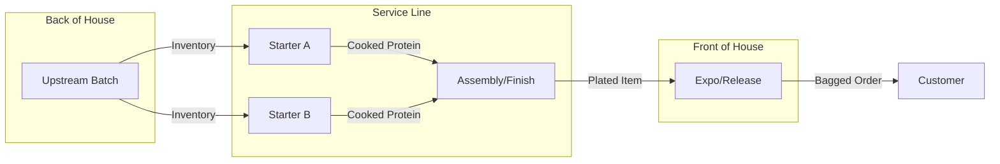

# TOP SHELF SERVICE LLC — Engine Architecture Standard

Version: 2.9.0  
Status: Frozen / Production Ready  
Philosophy: Separation of Concerns (Engine vs Fuel)

---

## 1) Core Paradigm: Engine vs Fuel

The application is a universal runtime that executes only when fed a content pack.

| Component | Analogy | Technical Reality |
| --- | --- | --- |
| Engine | Game Console | `UniversalEngine` runtime (brand-agnostic time/state/math) |
| Fuel | Game Cartridge | `generic_kitchen_template` content pack (stations, recipes, media, rules) |

Decision: menu and brand behavior changes are made in content data, not hardcoded engine branches.

---

## 2) Master Runtime Decision Tree

```mermaid
graph TD
    Start([App Launch]) --> CheckConfig{Config Loaded?}

    CheckConfig -- No --> Bootloader[Display Bootloader]
    Bootloader --> UserUpload[/User Uploads JSON/]
    UserUpload --> Validate{Valid JSON?}
    Validate -- No --> Error[Show Error]
    Validate -- Yes --> InitState[Initialize State]

    InitState --> Idle[Idle State]
    Idle --> Tick((1s Tick))

    Tick --> CheckPause{Is Paused?}
    CheckPause -- Yes --> Idle
    CheckPause -- No --> IterateStations[Loop Stations]

    IterateStations --> CheckChaos{Station in Chaos?}
    CheckChaos -- Yes --> Skip[Skip Progress]
    CheckChaos -- No --> ProcessItems[Increment Item Progress]

    ProcessItems --> CheckDone{Item Duration Met?}
    CheckDone -- Yes --> MarkComplete[Mark Complete]
    CheckDone -- No --> Continue

    Continue --> RollChaos{RNG < Risk Threshold?}
    RollChaos -- Yes --> InjectChaos[Trigger Event (Halt/Slow/Rush)]
    RollChaos -- No --> RenderUI

    RenderUI --> UserAction{User Action}
    UserAction -- New Ticket --> ParseRecipe[Read Recipe Steps]
    ParseRecipe --> AssignStations[Assign Items to Stations]

    UserAction -- Fix Chaos --> ResolveChaos[Clear Station Status]

    AssignStations --> Idle
    ResolveChaos --> Idle
```

---

## 3) Kitchen Topology Standard (Linear Assembly)

Default sequential flow:

1. Producer (Batch)
2. Starter (Service)
3. Assembler (Service)
4. Finisher (Service)
5. Expo (QC)

### Topology-to-Role Mapping (Deterministic)

To avoid ambiguity between visual station names and schema roles:

- `Producer` maps to role `producer`
- `Starter` maps to role `assembler` (service execution role)
- `Assembler` maps to role `assembler`
- `Finisher` maps to role `assembler` unless explicitly configured as final release gate
- `Expo` maps to role `qc`

This mapping is normative for runtime routing and validation.



---

## 4) Data Contract (Fuel Schema)

### 4.1 Station Schema

- `role`
  - `producer`: batch/inventory work
  - `assembler`: queue/ticket work
  - `qc`: final release gate
- `type`
  - `batch`: checklist UI behavior
  - `service`: ticket-stream UI behavior
- `media`
  - `layout`: station diagram path
  - `guide`: SOP PDF/video path
- `chaos_risk`: float `0.0..1.0`

### 4.2 Recipe Schema

- `media`
  - `plate_final`: gold-standard final image
  - `video_guide`: full build guide
- `steps`
  - `dependency`: previous `item` gate
  - `media`: action-level GIF/image/video

### 4.3 Chaos Schema

- `effect`
  - `halt`: `0x` progress
  - `slow`: reduced progress (for example `0.5x`)
  - `rush`: burst ticket generation

---

## 5) UI/UX Standards

- Visual style: industrial, high-contrast, dark mode
- Color palette:
  - background: `#050507`
  - surface: `#181A1F`
  - primary action: `#22C55E`
  - alert/chaos: `#EF4444`
- Iconography: Lucide React, mapped by `icon_key`

---

## 6) Implementation Status Snapshot (v2.9.0)

Target baseline includes:

- brand-agnostic station keys
- media slots in station/recipe/step objects
- support for batch -> dual starter -> assembly -> expo topology
- probabilistic chaos engine

---

## 7) Governance Note

Hardcoding food-specific logic in the engine is technical debt. Menu, media, and station specifics belong in the Fuel content pack.
