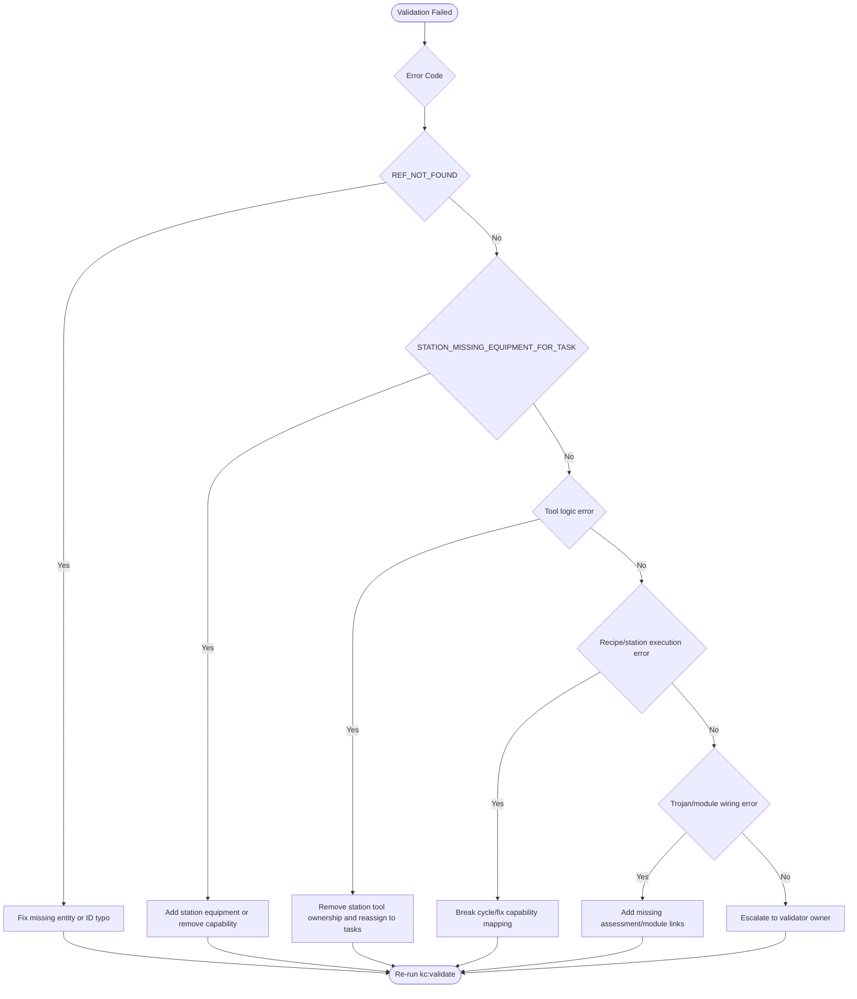
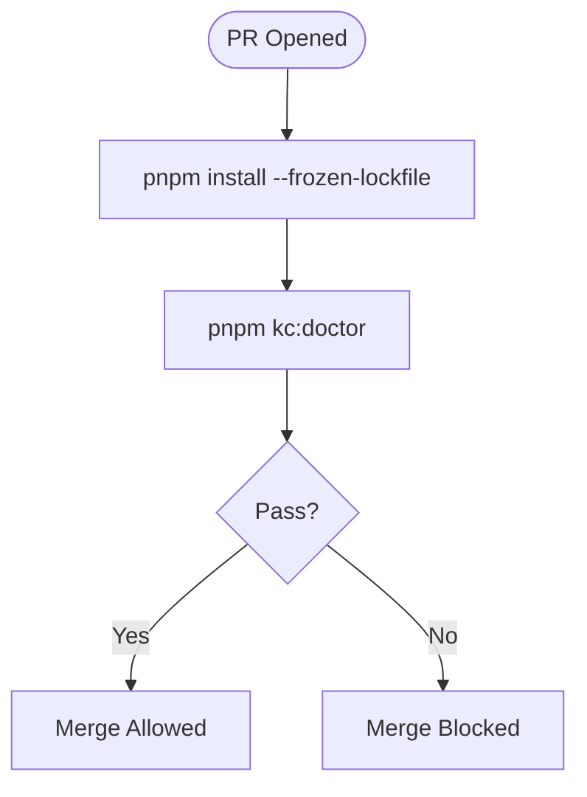

# TopShelf Standard — Deterministic Master Spec

Version: 2.1  
Status: Active  
Date: 2026-02-12

---

## 1) Purpose

This is the canonical source of truth for:

1. Knowledge Core governance (schemas, packs, validation, compilation, retrieval)
2. Reliability guardrails (doctor, CI, self-heal boundaries)
3. Assistant hardening rules
4. Training simulation alignment boundaries and future flags

If any other draft conflicts with this document, this document wins.

---

## 2) Canonical Decisions (Non-Negotiable)

### Toolchain

- Package manager: **pnpm only**
- Node runtime: **>= 20**
- No npm/yarn commands in local or CI

### Distribution

- No registry publishing required
- Canonical outputs are `dist/` artifacts and release assets

### Source of Truth

- Authoring source: YAML in repository
- Runtime source: compiled artifacts only
- Runtime clients must not parse raw authoring YAML directly

### Merge Policy

- CI must pass `kc:doctor`
- Blocking validator errors fail merge

---

## 3) Domain Boundaries

This repository contains two domains that must stay separated.

### A) Knowledge Core Domain (current implementation priority)

- Entity headers and registries
- Pack schema and compiler
- Indexing and retrieval contracts
- CI, doctor, and remediation loops

### B) Training Simulation Domain (product layer)

- Solve-first pedagogy
- Session flow, chaos logic, communication drills
- Station lifecycle playbooks

Rule: Domain B consumes Domain A contracts/artifacts and may not redefine core contracts.

---

## 4) Canonical Command Contract

Use one command family:

```bash
pnpm install --frozen-lockfile
pnpm kc:index
pnpm kc:validate
pnpm kc:compile
pnpm kc:test
pnpm kc:doctor
pnpm kc:serve
```

### Required script semantics

- `kc:index`: build/update index
- `kc:validate`: schema + semantic checks
- `kc:compile`: compile packs to `dist/packs`
- `kc:test`: run tests
- `kc:doctor`: deterministic operational loop
- `kc:serve`: retrieval API

Legacy `pnpm doctor` may exist as a temporary alias only.

---

## 5) Data Model Contracts

### 5.1 Universal Entity Header

Every indexed entity must include:

- `kind`
- `id`
- `version` (semver)

### 5.2 Pack Contract

Required sections:

- `equipment`
- `tools`
- `tasks`
- `stations`
- `recipes`

Optional sections:

- `training_modules`
- `assessments`
- `competencies`
- `downtime_decisions`
- `chaos_events`
- `governance`

### 5.3 Validation Output Contract

Validators return:

- `pass: boolean`
- `errors: ValidationError[]`
- `warnings: ValidationWarning[]`

Each blocking error must include:

- `code`, `message`, `entity_kind`, `entity_id`, `field`
- `thinking` (observation/reasoning/conclusion)
- ordered `remediation[]`
- `retry` metadata

---

## 6) Deterministic Pipeline

1. **Index**  
   Build `dist/index.sqlite` and `dist/index.json`
2. **Validate**  
   Run schema + semantic validators (blocking on error)
3. **Compile**  
   Emit `dist/packs/<pack-id>@<version>.json`
4. **Test**  
   Validate runtime behavior
5. **Serve**  
   Serve deterministic retrieval responses

---

## 7) Retrieval Contract

Minimum query:

- `(kind, id)`

Version behavior:

- exact version → exact match
- range (`^`, `~`) → semver max satisfying
- omitted version → latest active by semver

Response must include:

- metadata headers
- `source_path`
- `payload_ref` (pointer/reference)

---

## 8) Reliability and Self-Heal Boundaries

### 8.1 Health endpoints

- `/healthz`: process liveness
- `/readyz`: index readable + basic lookup + schemas available
- `/livez` (optional): deep liveness probe

### 8.2 Allowed self-heal

Allowed:

- rebuild missing index artifacts
- rebuild missing compiled pack artifacts
- rebuild stale generated artifacts via deterministic checksum strategy

Disallowed:

- auto-editing YAML sources
- auto-changing schema rules
- auto-bumping versions
- suppressing validator failures

### 8.3 Doctor loop (`kc:doctor`)

Order is fixed:

1. toolchain checks
2. index
3. validate
4. compile
5. test
6. retrieval smoke check

Any failure exits non-zero.

---

## 9) CI Contract

CI must mirror local golden path:

1. Setup Node 20
2. Setup pnpm
3. `pnpm install --frozen-lockfile`
4. `pnpm kc:doctor`

CI must reject:

- npm/yarn usage
- schema/semantic validation failures
- compile/test failures

---

## 10) Assistant Hardening

`AGENTS.md` must define:

- pnpm-only command policy
- allowed edit boundaries
- prohibited zones requiring explicit approval
- escalation policy for ambiguity/conflicts
- required output format (changed paths + validation summary)

Manuals required:

- `docs/manuals/TECH_MANUAL.md`
- `docs/manuals/DEV_MANUAL.md`
- `docs/manuals/USER_MANUAL.md`
- `docs/runbooks/RELIABILITY.md`

---

## 11) Deterministic Decision Trees

### 11.1 Validation triage



### 11.2 Merge gate



---

## 12) Training Simulation Alignment (Domain B)

Supported concepts:

- Solve First, Teach Second
- Gate → Cold Open → Gap Fill → Simulation
- Horizon/capacity logic
- Communication and friction drills

These are product-layer behaviors and do not replace governance contracts.

---

## 13) Future Flags (Approved Deferred Scope)

Deferred from MVP but explicitly accepted:

1. station-specific **opening** checklists
2. station-specific **closing** checklists
3. schedule-triggered lifecycle gates (`AM setup`, `PM close`)

When implemented, model as optional protocol sections with non-breaking defaults.

---

## 14) Entropy Controls

Primary entropy sources:

- mixed command families
- schema/docs drift
- validator contradictions
- manual edits to generated artifacts

Controls:

- single command family (`kc:*`)
- pinned node/pnpm policy
- doctor in local + CI
- generated artifacts treated as disposable outputs

---

## 15) MVP Definition of Done

MVP is complete when:

1. `pnpm kc:doctor` passes locally and in CI
2. pack outputs are deterministic/reproducible
3. retrieval resolves `(kind, id, version?)` deterministically
4. validation emits structured remediation paths
5. manuals and agent policy docs exist and align with this spec

---

## 16) Immediate Execution Order

1. Align `package.json` scripts to `kc:*`
2. Normalize CI to Node 20 + pnpm-only
3. Implement/verify doctor loop order
4. Verify retrieval response includes `payload_ref`
5. Create manuals + reliability runbook stubs

This is the deterministic final baseline.

---

## 17) External Source Ingest — Engine v2.9.0

Source ingested: **Top Shelf Service LLC System Architecture Standard v2.9.0**.

Accepted as canonical for Domain B (Training Simulation Runtime):

- Engine vs Fuel separation is mandatory
- Engine is universal runtime behavior; Fuel is content pack data
- Runtime loop is tick-based and deterministic
- Kitchen topology defaults to linear assembly flow
- Chaos model supports `halt`, `slow`, `rush`

### 17.1 Precedence Rule

When conflicts exist:

1. Domain A (Knowledge Core governance) in this file remains authoritative
2. Domain B runtime semantics from v2.9.0 are authoritative for simulation behavior
3. If unresolved, fail closed and escalate to architecture owner

---

## 18) Domain B Runtime Contract (from v2.9.0)

### 18.1 Engine vs Fuel

- **Engine**: brand-agnostic runtime (`UniversalEngine` concept)
- **Fuel**: external content pack (`generic_kitchen_template` concept)
- Menu/business variation must be data edits, not engine code edits

### 18.2 Runtime Tick Loop

Per tick:

1. skip if paused
2. iterate stations
3. apply chaos state (may halt/slow)
4. increment active item progress
5. complete items that reached duration
6. roll chaos injection by station risk threshold
7. render state and process user actions

### 18.3 User Actions (minimum)

- create ticket
- parse recipe steps
- assign steps to stations
- resolve chaos event

---

## 19) Domain B Topology and Schema Extensions

### 19.1 Default Line Topology

`Producer -> Starter -> Assembler -> Finisher -> Expo`

This is the default operational flow. Implementations may branch physically, but execution order must remain explicit and deterministic.

### 19.2 Station Extension Contract

Required simulation station fields:

- `role`: `producer | assembler | qc`
- `type`: `batch | service`
- `chaos_risk`: `0.0..1.0`

Optional media:

- `media.layout`
- `media.guide`

### 19.3 Recipe Extension Contract

Required simulation recipe capabilities:

- final reference media (`plate_final` equivalent)
- step-level dependencies
- step-level media hooks

### 19.4 Chaos Extension Contract

Allowed chaos effects:

- `halt`
- `slow`
- `rush`

---

## 20) Required Companion Document

Human-facing runtime architecture file:

- `TSSP_Engine_Architecture_v2.9.0.md`

Purpose:

- preserve rationale, visual flows, and implementation intent for Engine v2.9.0
- keep this `stand.md` concise as the policy contract

---

## 21) Deterministic Precedence Stack (Final Review)

This stack is the authoritative conflict resolver across assistant, static governance, and runtime behavior.

1. **Safety/compliance hard constraints**  
   Legal/compliance and prohibited-action boundaries always win.
2. **Domain A policy contract (`stand.md`)**  
   Governance, validation, retrieval, CI, and self-heal boundaries.
3. **Executable enforcement in CI/doctor/checks**  
   Actual run-path gates (`checks`, `doctor`, workflow) enforce policy.
4. **Domain B runtime architecture (`TSSP_Engine_Architecture_v2.9.0.md`)**  
   Tick loop, topology, station behavior, chaos semantics.
5. **Assistant operating guidance (`AGENTS.md` and manuals)**  
   Assistant behavior must comply with 1–4 and cannot override contracts.
6. **Content Pack (Fuel)**  
   Data drives behavior only within allowed Engine contracts.

Tie-break rules:

- If policy and runtime docs conflict, policy wins unless policy explicitly delegates runtime behavior.
- If docs and executable checks conflict, executable checks are current truth, and policy/docs must be updated immediately.
- If unresolved, fail closed and escalate.

---

## 22) Implementation Maturity Map (PR Branch Review)

Observed maturity from `origin/copilot/build-standards-repository`:

- **Governance docs depth:** high
- **Toolchain/CI enforcement:** medium-high
- **Validator/compiler/retrieval runtime implementation:** low (stub-heavy)

Current practical implication:

- Separation is architecturally strong in documents and folder boundaries.
- Determinism is strongly declared in policy.
- End-to-end enforcement is partial until validator/compiler/retrieval stubs are fully implemented.

Required next enforcement upgrades:

1. Replace `engine/validators/run-all.ts` stub with real schema + semantic orchestration.
2. Replace `engine/compiler/build-pack.ts` stub with deterministic compile pipeline.
3. Replace `scripts/retrieval-server.ts` stub with actual serving and contract enforcement.
4. Align script naming to canonical `kc:*` family (keep `doctor` alias only temporarily).
5. Add CI assertions that fail if critical scripts are still stub-only.

---

## 23) MVP -> Production Translation Contract

Goal: move from MVP to production by increasing enforcement depth, not by changing architecture.

### 23.1 Non-Breaking Invariants (must remain unchanged)

- Engine vs Fuel separation
- Domain A policy precedence over Domain B behavior
- Compiled artifact consumption at runtime (no raw authoring-source reads)
- Deterministic resolver contract for `(kind, id, version?)`
- Fail-closed behavior on unresolved contract conflicts

### 23.2 Stage Gates

#### Stage A (MVP)

- Docs and contracts defined
- Toolchain checks active
- Basic CI + doctor path active

#### Stage B (Hardening)

- Validator orchestration implemented (replace stubs)
- Pack compiler implemented (replace stubs)
- Retrieval server implemented with contract checks
- CI blocks stub markers in critical runtime files

#### Stage C (Production)

- Full schema + semantic validation coverage
- Deterministic compile outputs verified across repeated runs
- Retrieval smoke + regression suite in CI
- Operational runbook validated (health/readiness/escalation)

### 23.3 Production Readiness Exit Criteria

Production promotion is allowed only when all are true:

1. No critical runtime stubs remain in validator/compiler/retrieval paths.
2. CI enforces all contract boundaries and fails closed on drift.
3. Same input pack set produces byte-stable outputs across at least 3 runs.
4. Runtime and assistant layers both pass precedence conflict tests.
5. Rollback path is documented and tested.

### 23.4 Translation Principle

MVP -> Production is a **depth upgrade**, not a **design pivot**.

- Add enforcement, coverage, and observability.
- Do not rewrite contracts unless governance explicitly approves a versioned breaking change.

---

## 24) No-Stub Policy (Hard Gate)

No stubs are permitted in runtime-critical paths.

Runtime-critical paths include:

- `engine/validators/run-all.ts`
- `engine/compiler/build-pack.ts`
- `scripts/retrieval-server.ts`
- `scripts/doctor.ts`
- `scripts/health/checks.ts`

Disallowed markers in those files include (case-insensitive):

- `stub`
- `placeholder`
- `would start`
- `todo`

Enforcement command:

```bash
bash scripts/health/no-stubs.sh
```

Promotion rule:

- Any no-stub violation is a release blocker and CI must fail closed.
- CI must run `scripts/dev/use-env.sh local` + `scripts/dev/preflight.sh` before merge.

